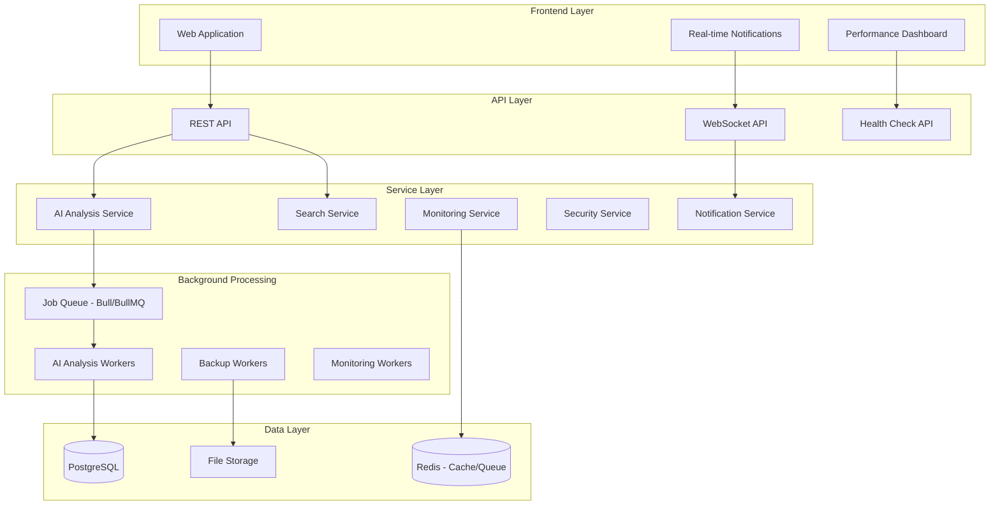
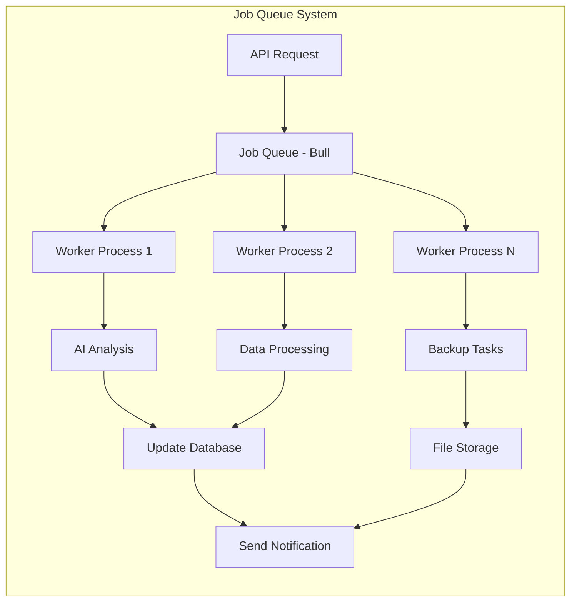

# Design Document

## Overview

Science Paper Manager의 시스템 고도화를 위한 설계 문서입니다. AI 분석 백그라운드 처리, 고급 검색, 성능 모니터링, 보안 강화, 실시간 알림, 데이터 백업, API 사용량 추적, 시스템 건강성 체크 등의 기능을 체계적으로 구현합니다.

현재 시스템의 한계점:
- AI 분석이 동기적으로 처리되어 사용자 경험 저하
- 기본적인 검색 기능만 제공
- 성능 모니터링 부재
- 보안 강화 필요
- 실시간 피드백 시스템 부재

## Architecture

### 전체 시스템 아키텍처



### 백그라운드 작업 처리 아키텍처



## Components and Interfaces

### 1. AI 분석 백그라운드 처리 시스템

**위치**: `src/services/background/`

**핵심 컴포넌트**:
```typescript
// Job Queue Manager
interface JobQueueManager {
  addAnalysisJob(paperId: string, providers: AIProvider[]): Promise<string>
  getJobStatus(jobId: string): Promise<JobStatus>
  cancelJob(jobId: string): Promise<boolean>
  retryFailedJob(jobId: string): Promise<string>
}

// AI Analysis Worker
interface AIAnalysisWorker {
  processAnalysisJob(job: AnalysisJob): Promise<void>
  handleJobFailure(job: AnalysisJob, error: Error): Promise<void>
  updateJobProgress(jobId: string, progress: number): Promise<void>
}

// Job Status Types
interface JobStatus {
  id: string
  status: 'pending' | 'processing' | 'completed' | 'failed'
  progress: number
  startedAt?: Date
  completedAt?: Date
  error?: string
  result?: AIAnalysisResult
}
```

**구현 기술**:
- **Queue System**: Bull/BullMQ with Redis
- **Worker Processes**: Node.js cluster workers
- **Progress Tracking**: Redis-based progress storage
- **Error Handling**: Exponential backoff retry logic

### 2. 고급 검색 및 필터링 시스템

**위치**: `src/services/search/`

**검색 엔진 구조**:
```typescript
interface AdvancedSearchService {
  searchPapers(query: SearchQuery): Promise<SearchResult>
  buildSearchFilters(filters: SearchFilters): SearchQuery
  applySorting(results: Paper[], sortBy: SortOption): Paper[]
  getSearchSuggestions(partialQuery: string): Promise<string[]>
}

interface SearchFilters {
  rating?: { min: number; max: number }
  tags?: string[]
  dateRange?: { start: Date; end: Date }
  journals?: string[]
  authors?: string[]
  readingStatus?: ReadingStatus[]
}

interface SearchQuery {
  textQuery?: string
  filters: SearchFilters
  sortBy: SortOption
  pagination: { page: number; limit: number }
}
```

**데이터베이스 최적화**:
```sql
-- 고급 검색을 위한 인덱스
CREATE INDEX CONCURRENTLY idx_papers_search_vector 
ON papers USING GIN (to_tsvector('english', title || ' ' || abstract));

CREATE INDEX CONCURRENTLY idx_papers_composite_search 
ON papers (publication_year, reading_status) 
INCLUDE (title, authors, journal);

CREATE INDEX CONCURRENTLY idx_user_evaluations_rating_tags 
ON user_evaluations (rating, tags) 
WHERE rating IS NOT NULL;
```

### 3. 성능 모니터링 시스템

**위치**: `src/services/monitoring/`

**모니터링 구조**:
```typescript
interface PerformanceMonitor {
  trackAPIRequest(req: Request, res: Response, duration: number): void
  trackDatabaseQuery(query: string, duration: number, rows: number): void
  trackUserAction(userId: string, action: string, metadata?: object): void
  getMetrics(timeRange: TimeRange): Promise<PerformanceMetrics>
}

interface PerformanceMetrics {
  apiMetrics: {
    averageResponseTime: number
    requestsPerMinute: number
    errorRate: number
    slowestEndpoints: EndpointMetric[]
  }
  databaseMetrics: {
    averageQueryTime: number
    slowestQueries: QueryMetric[]
    connectionPoolStatus: PoolStatus
  }
  userMetrics: {
    activeUsers: number
    mostUsedFeatures: FeatureUsage[]
    userSessions: SessionMetric[]
  }
}
```

**메트릭 수집 미들웨어**:
```typescript
// API 성능 추적 미들웨어
export function performanceTrackingMiddleware(
  req: Request, 
  res: Response, 
  next: NextFunction
) {
  const startTime = Date.now()
  
  res.on('finish', () => {
    const duration = Date.now() - startTime
    performanceMonitor.trackAPIRequest(req, res, duration)
  })
  
  next()
}
```

### 4. 보안 강화 시스템

**위치**: `src/services/security/`

**보안 컴포넌트**:
```typescript
interface SecurityService {
  encryptAPIKey(key: string, userId: string): Promise<EncryptedData>
  decryptAPIKey(encryptedData: EncryptedData, userId: string): Promise<string>
  validateSession(token: string): Promise<SessionValidation>
  detectSuspiciousActivity(userId: string, action: string): Promise<ThreatLevel>
  generateCSRFToken(sessionId: string): string
  validateCSRFToken(token: string, sessionId: string): boolean
}

interface EncryptedData {
  encryptedValue: string
  iv: string
  salt: string
  hash: string
}

interface SessionValidation {
  isValid: boolean
  userId?: string
  expiresAt?: Date
  needsRefresh?: boolean
}
```

**암호화 구현**:
```typescript
class AdvancedEncryption {
  private static readonly ALGORITHM = 'aes-256-gcm'
  private static readonly KEY_LENGTH = 32
  private static readonly IV_LENGTH = 16
  
  static async encrypt(data: string, userKey: string): Promise<EncryptedData> {
    const salt = crypto.randomBytes(16)
    const key = crypto.pbkdf2Sync(userKey, salt, 100000, this.KEY_LENGTH, 'sha256')
    const iv = crypto.randomBytes(this.IV_LENGTH)
    
    const cipher = crypto.createCipher(this.ALGORITHM, key)
    cipher.setAAD(Buffer.from(userKey))
    
    let encrypted = cipher.update(data, 'utf8', 'hex')
    encrypted += cipher.final('hex')
    
    const authTag = cipher.getAuthTag()
    
    return {
      encryptedValue: encrypted,
      iv: iv.toString('hex'),
      salt: salt.toString('hex'),
      hash: crypto.createHash('sha256').update(data).digest('hex')
    }
  }
}
```

### 5. 실시간 알림 시스템

**위치**: `src/services/notifications/`

**알림 시스템 구조**:
```typescript
interface NotificationService {
  sendNotification(userId: string, notification: Notification): Promise<void>
  subscribeToUpdates(userId: string, callback: NotificationCallback): void
  getNotificationHistory(userId: string, limit: number): Promise<Notification[]>
  markAsRead(notificationId: string): Promise<void>
  updateNotificationSettings(userId: string, settings: NotificationSettings): Promise<void>
}

interface Notification {
  id: string
  userId: string
  type: NotificationType
  title: string
  message: string
  data?: object
  createdAt: Date
  readAt?: Date
  priority: 'low' | 'medium' | 'high' | 'urgent'
}

type NotificationType = 
  | 'ai_analysis_complete'
  | 'new_paper_added'
  | 'system_update'
  | 'security_alert'
  | 'backup_complete'
```

**WebSocket 구현**:
```typescript
// WebSocket 서버 설정
class NotificationWebSocketServer {
  private wss: WebSocketServer
  private connections: Map<string, WebSocket> = new Map()
  
  constructor(server: Server) {
    this.wss = new WebSocketServer({ server })
    this.setupConnectionHandling()
  }
  
  private setupConnectionHandling() {
    this.wss.on('connection', (ws, req) => {
      const userId = this.extractUserIdFromRequest(req)
      if (userId) {
        this.connections.set(userId, ws)
        this.setupHeartbeat(ws, userId)
      }
    })
  }
  
  sendToUser(userId: string, notification: Notification) {
    const ws = this.connections.get(userId)
    if (ws && ws.readyState === WebSocket.OPEN) {
      ws.send(JSON.stringify(notification))
    }
  }
}
```

### 6. 데이터 백업 및 복구 시스템

**위치**: `src/services/backup/`

**백업 시스템 구조**:
```typescript
interface BackupService {
  createBackup(type: BackupType): Promise<BackupResult>
  scheduleBackup(schedule: BackupSchedule): Promise<void>
  restoreFromBackup(backupId: string): Promise<RestoreResult>
  validateBackup(backupId: string): Promise<ValidationResult>
  listBackups(filter?: BackupFilter): Promise<BackupInfo[]>
}

interface BackupResult {
  id: string
  type: BackupType
  size: number
  duration: number
  checksum: string
  createdAt: Date
  status: 'success' | 'failed' | 'partial'
}

type BackupType = 'full' | 'incremental' | 'differential'
```

**백업 스케줄러**:
```typescript
class BackupScheduler {
  private jobs: Map<string, NodeCron.ScheduledTask> = new Map()
  
  scheduleBackup(schedule: BackupSchedule) {
    const task = cron.schedule(schedule.cronExpression, async () => {
      try {
        await this.backupService.createBackup(schedule.type)
        await this.notificationService.sendNotification(
          'admin',
          this.createBackupSuccessNotification()
        )
      } catch (error) {
        await this.handleBackupError(error, schedule)
      }
    })
    
    this.jobs.set(schedule.id, task)
  }
}
```

## Data Models

### 1. 작업 큐 관련 테이블

```sql
-- 백그라운드 작업 테이블
CREATE TABLE background_jobs (
  id UUID PRIMARY KEY DEFAULT gen_random_uuid(),
  type VARCHAR(50) NOT NULL,
  status VARCHAR(20) DEFAULT 'pending',
  priority INTEGER DEFAULT 0,
  data JSONB NOT NULL,
  progress INTEGER DEFAULT 0,
  result JSONB,
  error_message TEXT,
  attempts INTEGER DEFAULT 0,
  max_attempts INTEGER DEFAULT 3,
  created_at TIMESTAMP WITH TIME ZONE DEFAULT now(),
  started_at TIMESTAMP WITH TIME ZONE,
  completed_at TIMESTAMP WITH TIME ZONE,
  user_id UUID REFERENCES auth.users(id)
);

CREATE INDEX idx_background_jobs_status ON background_jobs(status);
CREATE INDEX idx_background_jobs_type ON background_jobs(type);
CREATE INDEX idx_background_jobs_user_id ON background_jobs(user_id);
```

### 2. 성능 모니터링 테이블

```sql
-- API 성능 메트릭
CREATE TABLE api_metrics (
  id BIGSERIAL PRIMARY KEY,
  endpoint VARCHAR(255) NOT NULL,
  method VARCHAR(10) NOT NULL,
  status_code INTEGER NOT NULL,
  response_time INTEGER NOT NULL, -- milliseconds
  user_id UUID REFERENCES auth.users(id),
  ip_address INET,
  user_agent TEXT,
  created_at TIMESTAMP WITH TIME ZONE DEFAULT now()
);

-- 데이터베이스 쿼리 메트릭
CREATE TABLE db_query_metrics (
  id BIGSERIAL PRIMARY KEY,
  query_hash VARCHAR(64) NOT NULL,
  query_type VARCHAR(20) NOT NULL,
  execution_time INTEGER NOT NULL, -- milliseconds
  rows_affected INTEGER,
  created_at TIMESTAMP WITH TIME ZONE DEFAULT now()
);

-- 시계열 데이터를 위한 파티셔닝
CREATE TABLE api_metrics_y2024m01 PARTITION OF api_metrics
FOR VALUES FROM ('2024-01-01') TO ('2024-02-01');
```

### 3. 알림 시스템 테이블

```sql
-- 알림 테이블
CREATE TABLE notifications (
  id UUID PRIMARY KEY DEFAULT gen_random_uuid(),
  user_id UUID REFERENCES auth.users(id) ON DELETE CASCADE,
  type VARCHAR(50) NOT NULL,
  title VARCHAR(255) NOT NULL,
  message TEXT NOT NULL,
  data JSONB DEFAULT '{}',
  priority VARCHAR(10) DEFAULT 'medium',
  read_at TIMESTAMP WITH TIME ZONE,
  created_at TIMESTAMP WITH TIME ZONE DEFAULT now()
);

-- 알림 설정 테이블
CREATE TABLE notification_settings (
  id UUID PRIMARY KEY DEFAULT gen_random_uuid(),
  user_id UUID REFERENCES auth.users(id) ON DELETE CASCADE,
  type VARCHAR(50) NOT NULL,
  enabled BOOLEAN DEFAULT true,
  delivery_method VARCHAR(20) DEFAULT 'web', -- 'web', 'email', 'push'
  created_at TIMESTAMP WITH TIME ZONE DEFAULT now(),
  updated_at TIMESTAMP WITH TIME ZONE DEFAULT now(),
  
  UNIQUE(user_id, type)
);
```

### 4. 백업 관리 테이블

```sql
-- 백업 정보 테이블
CREATE TABLE backup_records (
  id UUID PRIMARY KEY DEFAULT gen_random_uuid(),
  type VARCHAR(20) NOT NULL, -- 'full', 'incremental', 'differential'
  status VARCHAR(20) DEFAULT 'in_progress',
  file_path TEXT NOT NULL,
  file_size BIGINT,
  checksum VARCHAR(64),
  duration_ms INTEGER,
  created_at TIMESTAMP WITH TIME ZONE DEFAULT now(),
  completed_at TIMESTAMP WITH TIME ZONE
);

-- 백업 스케줄 테이블
CREATE TABLE backup_schedules (
  id UUID PRIMARY KEY DEFAULT gen_random_uuid(),
  name VARCHAR(100) NOT NULL,
  type VARCHAR(20) NOT NULL,
  cron_expression VARCHAR(50) NOT NULL,
  is_active BOOLEAN DEFAULT true,
  last_run_at TIMESTAMP WITH TIME ZONE,
  next_run_at TIMESTAMP WITH TIME ZONE,
  created_at TIMESTAMP WITH TIME ZONE DEFAULT now()
);
```

## Error Handling

### 1. 백그라운드 작업 오류 처리

```typescript
class JobErrorHandler {
  static async handleJobFailure(job: Job, error: Error): Promise<void> {
    const jobData = job.data as AnalysisJobData
    
    // 재시도 로직
    if (job.attemptsMade < job.opts.attempts) {
      const delay = this.calculateBackoffDelay(job.attemptsMade)
      await job.retry(delay)
      return
    }
    
    // 최종 실패 처리
    await this.recordJobFailure(job.id, error)
    await this.notifyUserOfFailure(jobData.userId, job.id, error)
    
    // 관리자 알림 (심각한 오류의 경우)
    if (this.isCriticalError(error)) {
      await this.notifyAdministrators(job, error)
    }
  }
  
  private static calculateBackoffDelay(attempt: number): number {
    return Math.min(1000 * Math.pow(2, attempt), 30000) // 최대 30초
  }
}
```

### 2. 성능 모니터링 오류 처리

```typescript
class MonitoringErrorHandler {
  static async handleMetricCollectionError(error: Error, context: string): Promise<void> {
    // 메트릭 수집 실패는 시스템 동작을 방해하지 않아야 함
    console.error(`Metric collection failed in ${context}:`, error)
    
    // 오류 카운터 증가
    await this.incrementErrorCounter('metric_collection_failure')
    
    // 연속 실패 시 알림
    const failureCount = await this.getRecentFailureCount('metric_collection')
    if (failureCount > 10) {
      await this.alertAdministrators('High metric collection failure rate')
    }
  }
}
```

## Testing Strategy

### 1. 백그라운드 작업 테스트

```typescript
describe('AI Analysis Background Processing', () => {
  let jobQueue: JobQueueManager
  let testRedis: Redis
  
  beforeEach(async () => {
    testRedis = new Redis(process.env.TEST_REDIS_URL)
    jobQueue = new JobQueueManager(testRedis)
  })
  
  test('should process AI analysis job successfully', async () => {
    const jobId = await jobQueue.addAnalysisJob('paper-123', ['openai'])
    
    // 작업 완료까지 대기
    await waitForJobCompletion(jobId, 30000)
    
    const status = await jobQueue.getJobStatus(jobId)
    expect(status.status).toBe('completed')
    expect(status.result).toBeDefined()
  })
  
  test('should retry failed jobs with exponential backoff', async () => {
    // AI 서비스 모킹으로 실패 시뮬레이션
    mockAIService.mockRejectedValueOnce(new Error('API rate limit'))
    
    const jobId = await jobQueue.addAnalysisJob('paper-456', ['openai'])
    
    // 재시도 확인
    await waitFor(() => {
      expect(mockAIService).toHaveBeenCalledTimes(2)
    })
  })
})
```

### 2. 성능 모니터링 테스트

```typescript
describe('Performance Monitoring', () => {
  test('should track API response times accurately', async () => {
    const monitor = new PerformanceMonitor()
    const mockReq = createMockRequest('/api/papers')
    const mockRes = createMockResponse()
    
    const startTime = Date.now()
    monitor.trackAPIRequest(mockReq, mockRes, 150)
    
    const metrics = await monitor.getMetrics({ 
      start: new Date(startTime), 
      end: new Date() 
    })
    
    expect(metrics.apiMetrics.averageResponseTime).toBeCloseTo(150, 1)
  })
})
```

### 3. 통합 테스트

```typescript
describe('System Integration', () => {
  test('complete AI analysis workflow', async () => {
    // 1. 논문 업로드
    const paper = await uploadTestPaper()
    
    // 2. AI 분석 요청
    const analysisRequest = await requestAIAnalysis(paper.id, ['openai', 'anthropic'])
    
    // 3. 백그라운드 처리 완료 대기
    await waitForAnalysisCompletion(analysisRequest.jobId)
    
    // 4. 결과 확인
    const results = await getAnalysisResults(paper.id)
    expect(results).toHaveLength(2)
    
    // 5. 알림 확인
    const notifications = await getUserNotifications(testUserId)
    expect(notifications.some(n => n.type === 'ai_analysis_complete')).toBe(true)
  })
})
```

## Security Considerations

### 1. API 키 보안 강화

```typescript
class EnhancedAPIKeySecurity {
  // 키 회전 시스템
  static async rotateAPIKey(userId: string, provider: string): Promise<void> {
    const oldKey = await this.getAPIKey(userId, provider)
    const newKey = await this.generateNewAPIKey(provider)
    
    // 점진적 전환
    await this.setKeyRotationPeriod(userId, provider, oldKey, newKey, 24 * 60 * 60 * 1000)
  }
  
  // 키 사용 패턴 분석
  static async analyzeKeyUsagePattern(userId: string, provider: string): Promise<SecurityAssessment> {
    const usage = await this.getKeyUsageHistory(userId, provider)
    
    return {
      suspiciousActivity: this.detectAnomalousUsage(usage),
      riskLevel: this.calculateRiskLevel(usage),
      recommendations: this.generateSecurityRecommendations(usage)
    }
  }
}
```

### 2. 세션 보안 강화

```typescript
class AdvancedSessionSecurity {
  // 세션 지문 인식
  static generateSessionFingerprint(req: Request): string {
    const components = [
      req.headers['user-agent'],
      req.headers['accept-language'],
      req.headers['accept-encoding'],
      req.ip
    ]
    
    return crypto.createHash('sha256')
      .update(components.join('|'))
      .digest('hex')
  }
  
  // 세션 하이재킹 감지
  static async detectSessionHijacking(sessionId: string, currentFingerprint: string): Promise<boolean> {
    const storedFingerprint = await this.getStoredFingerprint(sessionId)
    return storedFingerprint !== currentFingerprint
  }
}
```

## Performance Optimization

### 1. 데이터베이스 최적화

```sql
-- 성능 모니터링을 위한 파티셔닝
CREATE TABLE api_metrics (
  id BIGSERIAL,
  endpoint VARCHAR(255) NOT NULL,
  response_time INTEGER NOT NULL,
  created_at TIMESTAMP WITH TIME ZONE DEFAULT now()
) PARTITION BY RANGE (created_at);

-- 월별 파티션 생성
CREATE TABLE api_metrics_2024_01 PARTITION OF api_metrics
FOR VALUES FROM ('2024-01-01') TO ('2024-02-01');

-- 자동 파티션 관리 함수
CREATE OR REPLACE FUNCTION create_monthly_partition(table_name TEXT, start_date DATE)
RETURNS VOID AS $
BEGIN
  EXECUTE format('CREATE TABLE %I PARTITION OF %I FOR VALUES FROM (%L) TO (%L)',
    table_name || '_' || to_char(start_date, 'YYYY_MM'),
    table_name,
    start_date,
    start_date + INTERVAL '1 month'
  );
END;
$ LANGUAGE plpgsql;
```

### 2. 캐싱 전략

```typescript
class AdvancedCaching {
  private redis: Redis
  private localCache: LRUCache<string, any>
  
  // 다층 캐싱
  async get<T>(key: string): Promise<T | null> {
    // L1: 로컬 메모리 캐시
    let value = this.localCache.get(key)
    if (value) return value
    
    // L2: Redis 캐시
    const redisValue = await this.redis.get(key)
    if (redisValue) {
      value = JSON.parse(redisValue)
      this.localCache.set(key, value)
      return value
    }
    
    return null
  }
  
  // 스마트 캐시 무효화
  async invalidatePattern(pattern: string): Promise<void> {
    const keys = await this.redis.keys(pattern)
    if (keys.length > 0) {
      await this.redis.del(...keys)
    }
    
    // 로컬 캐시도 패턴 매칭으로 무효화
    this.localCache.forEach((value, key) => {
      if (this.matchesPattern(key, pattern)) {
        this.localCache.delete(key)
      }
    })
  }
}
```

## Deployment Considerations

### 1. 환경 변수 추가

```bash
# 백그라운드 작업 처리
REDIS_URL=redis://localhost:6379
WORKER_CONCURRENCY=5
MAX_JOB_ATTEMPTS=3

# 성능 모니터링
MONITORING_ENABLED=true
METRICS_RETENTION_DAYS=30
PERFORMANCE_ALERT_THRESHOLD=1000

# 보안 설정
ENCRYPTION_KEY_ROTATION_DAYS=90
SESSION_TIMEOUT_MINUTES=60
CSRF_TOKEN_EXPIRY_MINUTES=30

# 알림 시스템
WEBSOCKET_PORT=3001
NOTIFICATION_BATCH_SIZE=100

# 백업 설정
BACKUP_STORAGE_PATH=/var/backups/science-paper-manager
BACKUP_RETENTION_DAYS=30
BACKUP_ENCRYPTION_KEY=your-backup-encryption-key
```

### 2. Docker 컨테이너 설정

```dockerfile
# Worker 프로세스를 위한 별도 컨테이너
FROM node:18-alpine AS worker

WORKDIR /app
COPY package*.json ./
RUN npm ci --only=production

COPY src/ ./src/
COPY tsconfig.json ./

CMD ["npm", "run", "worker"]
```

### 3. 모니터링 대시보드

```typescript
// 관리자 대시보드 API
export async function GET(request: NextRequest) {
  const metrics = await performanceMonitor.getMetrics({
    start: new Date(Date.now() - 24 * 60 * 60 * 1000), // 24시간
    end: new Date()
  })
  
  const systemHealth = await healthChecker.getSystemStatus()
  const jobQueueStatus = await jobQueue.getQueueStatus()
  
  return NextResponse.json({
    metrics,
    systemHealth,
    jobQueueStatus,
    timestamp: new Date().toISOString()
  })
}
```

이 설계를 바탕으로 시스템의 안정성, 성능, 보안을 크게 향상시킬 수 있습니다. 각 컴포넌트는 독립적으로 개발하고 테스트할 수 있도록 설계되었습니다.