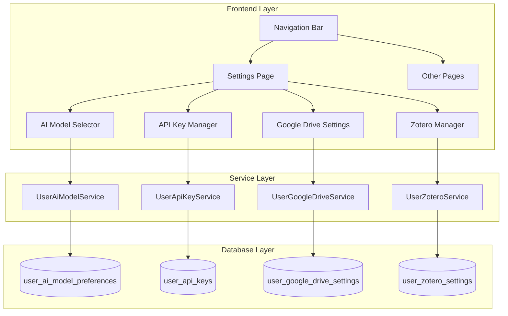
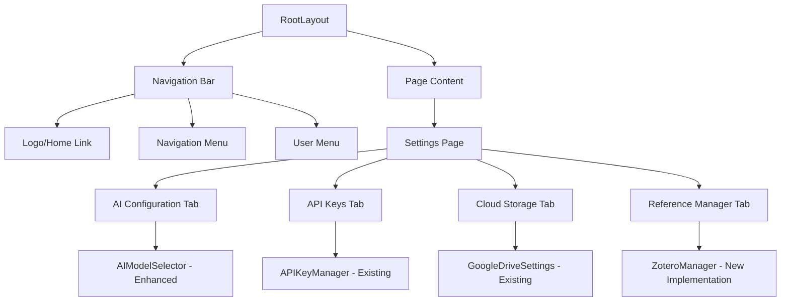

# Design Document

## Overview

사용자 설정 완성 기능은 현재 부분적으로 구현된 설정 관리 시스템을 완성하여 사용자가 AI 모델, Zotero, Google Drive API 키를 안전하게 관리할 수 있도록 합니다. 또한 일관된 네비게이션 경험을 제공하기 위해 전역 네비게이션 바를 구현합니다.

현재 시스템은 다음과 같은 상태입니다:
- 데이터베이스 스키마: 완성됨
- API Key 관리: 완성됨  
- Google Drive 설정: 완성됨
- AI 모델 설정: 부분적 구현 (UI는 있지만 실제 저장/로드 로직 미완성)
- Zotero 설정: 서비스는 있지만 UI 미완성
- 네비게이션: 기본 구조는 있지만 전역 적용 필요

## Architecture

### 시스템 아키텍처



### 컴포넌트 구조



## Components and Interfaces

### 1. Navigation Bar Component

**위치**: `src/components/layout/GlobalNavigation.tsx`

**기능**:
- 모든 페이지에서 일관된 네비게이션 제공
- 현재 페이지 하이라이트
- 사용자 인증 상태에 따른 메뉴 변경
- 반응형 디자인 (모바일/데스크톱)

**인터페이스**:
```typescript
interface NavigationItem {
  href: string
  label: string
  icon: React.ComponentType
  requiresAuth?: boolean
}

interface GlobalNavigationProps {
  className?: string
}
```

### 2. Enhanced AI Model Selector

**위치**: `src/components/ai/AIModelSelector.tsx` (기존 파일 개선)

**개선사항**:
- 실제 데이터베이스 저장/로드 기능 완성
- 사용자별 모델 설정 관리
- 모델 파라미터 실시간 저장
- 기본 모델 설정 기능

**주요 메서드**:
```typescript
interface AIModelSelectorEnhanced {
  loadUserPreferences(): Promise<void>
  saveModelPreference(provider: AIProvider, model: string): Promise<void>
  setDefaultModel(provider: AIProvider, model: string): Promise<void>
  updateModelParameters(provider: AIProvider, model: string, params: Record<string, any>): Promise<void>
}
```

### 3. Zotero Manager Implementation

**위치**: `src/components/zotero/ZoteroManager.tsx` (기존 파일 완성)

**구현할 기능**:
- Zotero API 키 입력 및 검증
- 라이브러리 타입 선택 (개인/그룹)
- 자동 동기화 설정
- 연결 상태 테스트
- 동기화 상태 모니터링

**컴포넌트 구조**:
```typescript
interface ZoteroManagerProps {
  onSettingsChange?: (settings: ZoteroSettingsInfo) => void
}

// 하위 컴포넌트들
- ZoteroConfigForm: API 키 및 기본 설정
- ZoteroConnectionTest: 연결 테스트
- ZoteroSyncSettings: 동기화 설정
- ZoteroSyncStatus: 동기화 상태 표시
```

### 4. Settings Export/Import

**위치**: `src/components/settings/SettingsBackup.tsx` (신규)

**기능**:
- 모든 사용자 설정을 JSON으로 내보내기
- 암호화된 설정 파일 생성
- 설정 파일 가져오기 및 검증
- 선택적 설정 복원

## Data Models

### 1. Enhanced Type Definitions

**위치**: `src/lib/database.ts` (기존 파일 개선)

**추가할 타입들**:
```typescript
// Navigation 관련
export interface NavigationState {
  currentPath: string
  isAuthenticated: boolean
  userRole?: string
}

// Settings Backup 관련
export interface SettingsBackup {
  version: string
  timestamp: string
  userId: string
  settings: {
    aiModels?: UserAiModelPreference[]
    apiKeys?: Partial<UserApiKey>[] // 암호화된 키는 제외
    googleDrive?: UserGoogleDriveSettings
    zotero?: UserZoteroSettings
  }
}

// Settings Export Options
export interface ExportOptions {
  includeApiKeys: boolean
  includeGoogleDrive: boolean
  includeZotero: boolean
  includeAiModels: boolean
  encryptData: boolean
}
```

### 2. Service Interfaces

**UserAiModelService 개선**:
```typescript
interface UserAiModelService {
  // 기존 메서드들...
  
  // 추가할 메서드들
  bulkUpdatePreferences(userId: string, preferences: ModelPreference[]): Promise<void>
  exportUserPreferences(userId: string): Promise<ModelPreference[]>
  importUserPreferences(userId: string, preferences: ModelPreference[]): Promise<void>
  resetToDefaults(userId: string, provider?: AIProvider): Promise<void>
}
```

## Error Handling

### 1. 설정 저장 오류 처리

**전략**:
- 네트워크 오류: 자동 재시도 (최대 3회)
- 검증 오류: 사용자에게 구체적인 오류 메시지 표시
- 권한 오류: 로그인 상태 확인 및 재인증 유도

**구현**:
```typescript
class SettingsErrorHandler {
  static async handleSaveError(error: Error, context: string): Promise<void> {
    if (error.message.includes('network')) {
      // 네트워크 오류 처리
      return this.retryWithBackoff(context)
    } else if (error.message.includes('validation')) {
      // 검증 오류 처리
      toast.error(`Invalid ${context}: ${error.message}`)
    } else if (error.message.includes('auth')) {
      // 인증 오류 처리
      router.push('/login')
    }
  }
}
```

### 2. API 키 검증 오류 처리

**검증 실패 시나리오**:
- 잘못된 키 형식
- 만료된 키
- 권한 부족
- 서비스 일시 중단

**사용자 피드백**:
- 실시간 검증 상태 표시
- 구체적인 오류 메시지
- 해결 방법 제안

## Testing Strategy

### 1. Unit Tests

**테스트 대상**:
- 각 서비스 클래스의 메서드
- 컴포넌트의 상태 관리 로직
- 데이터 변환 함수

**테스트 파일 위치**:
```
src/services/settings/__tests__/
├── UserAiModelService.test.ts
├── UserZoteroService.test.ts
└── SettingsBackupService.test.ts

src/components/settings/__tests__/
├── SettingsBackup.test.tsx
└── ZoteroManager.test.tsx

src/components/layout/__tests__/
└── GlobalNavigation.test.tsx
```

### 2. Integration Tests

**테스트 시나리오**:
- 설정 저장 → 페이지 새로고침 → 설정 로드
- API 키 저장 → 검증 → 사용
- 설정 내보내기 → 가져오기 → 검증

### 3. E2E Tests

**테스트 플로우**:
```typescript
// 설정 관리 E2E 테스트
describe('Settings Management', () => {
  test('사용자가 AI 모델을 설정하고 저장할 수 있다', async () => {
    // 1. 로그인
    // 2. 설정 페이지 이동
    // 3. AI Configuration 탭 클릭
    // 4. 모델 선택 및 저장
    // 5. 페이지 새로고침
    // 6. 설정이 유지되는지 확인
  })
})
```

## Security Considerations

### 1. API 키 보안

**암호화**:
- AES-256 암호화 사용
- 환경변수로 암호화 키 관리
- 클라이언트에서 평문 키 노출 방지

**저장**:
- 데이터베이스에 암호화된 형태로만 저장
- 해시값으로 무결성 검증
- RLS(Row Level Security) 정책 적용

### 2. 설정 백업 보안

**내보내기**:
- 민감한 정보 제외 옵션
- 암호화된 백업 파일 생성
- 사용자 정의 암호 지원

**가져오기**:
- 파일 무결성 검증
- 스키마 버전 호환성 확인
- 안전한 파싱 (JSON 인젝션 방지)

### 3. 네비게이션 보안

**접근 제어**:
- 인증된 사용자만 설정 페이지 접근
- 페이지별 권한 확인
- 자동 로그아웃 시 설정 페이지에서 리다이렉트

## Performance Optimization

### 1. 컴포넌트 최적화

**React 최적화**:
- `React.memo`로 불필요한 리렌더링 방지
- `useMemo`로 계산 비용이 큰 작업 캐싱
- `useCallback`로 함수 참조 안정화

**데이터 로딩**:
- 설정 데이터 지연 로딩
- 탭별 데이터 분할 로딩
- 캐싱으로 중복 요청 방지

### 2. 네트워크 최적화

**API 호출 최적화**:
- 배치 업데이트로 여러 설정 한 번에 저장
- 디바운싱으로 실시간 저장 최적화
- 낙관적 업데이트로 UX 개선

### 3. 번들 크기 최적화

**코드 분할**:
- 설정 페이지 동적 임포트
- 서비스별 코드 분할
- 사용하지 않는 코드 제거

## Accessibility

### 1. 키보드 네비게이션

**구현사항**:
- 모든 인터랙티브 요소에 키보드 접근 가능
- 논리적인 탭 순서
- 포커스 표시 명확화

### 2. 스크린 리더 지원

**ARIA 속성**:
- 적절한 레이블링
- 상태 변화 알림
- 구조적 마크업

### 3. 시각적 접근성

**색상 및 대비**:
- WCAG 2.1 AA 기준 준수
- 색상에만 의존하지 않는 정보 전달
- 다크 모드 지원

## Deployment Considerations

### 1. 환경 변수

**필수 환경 변수**:
```bash
# 암호화 키
NEXT_PUBLIC_ENCRYPTION_KEY=your-encryption-key

# Supabase 설정
NEXT_PUBLIC_SUPABASE_URL=your-supabase-url
NEXT_PUBLIC_SUPABASE_ANON_KEY=your-anon-key
SUPABASE_SERVICE_ROLE_KEY=your-service-role-key
```

### 2. 데이터베이스 마이그레이션

**확인사항**:
- 모든 테이블이 생성되었는지 확인
- RLS 정책이 적용되었는지 확인
- 인덱스가 생성되었는지 확인

### 3. 모니터링

**추적할 메트릭**:
- 설정 저장 성공률
- API 키 검증 성공률
- 페이지 로딩 시간
- 오류 발생률

이 설계를 바탕으로 단계별 구현을 진행하여 사용자 설정 기능을 완성할 수 있습니다.